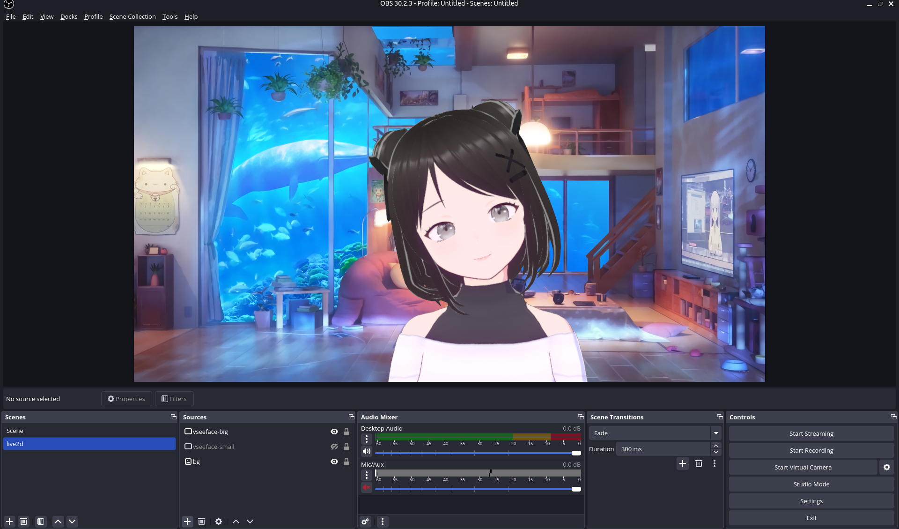
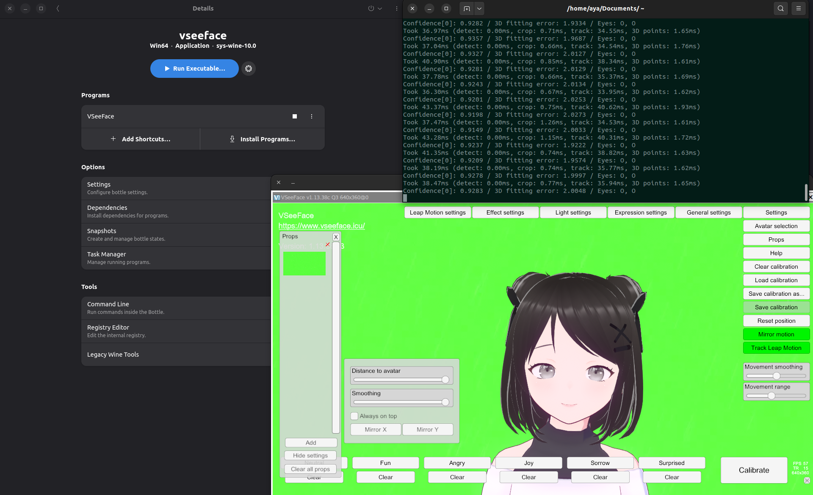

# projects

1. [fish shell init script](#1-fish-shell-init-script) - 22 mar 2025
2. [VTuber avatar on Ubuntu](#2-vtuber-avatar-on-ubuntu) - 27 apr 2025

---

# 1. fish shell init script
## files 
[config.fish](./config.fish)

## description 
my fish config file. a simple piece of initialiser code to make the terminal more convenient for dev purposes.

written for [fish shell](https://fishshell.com/).

## features

### greeting message

each time the terminal is launched, or when user runs `fp`, the terminal outputs a randomised personalised greeting message (in chinese) from a curated list, with two parts:

1. an original quote that may or may not be related to coding
2. a welcomer message

#### sample 1:

```
云山万行 终归终端
          —— 开发者，请执刻刀
```
#### sample 2:

```
星藏点雪 月隐晦明 拙山枯水大江行
          —— 终端候君久矣
```

### manual call

the command `fg` can also be run to manually call a randomised greeting. additionally, use `fg -la` to list all available greetings in the greeting pool.

```bash
 ~> fish_greeting -la

List A:
  梦如人生 梦入长卷
  星藏点雪 月隐晦明 拙山枯水大江行
  雪落无声 内存不染
  山棱崩摧处 正是重构时
  云山万行 终归终端
  旧城烟雨里 遗留系统眠
  青铜鼎铭文 恰似注释生
  浮生半日无bug
  落花浮水 指针自流转
  月照空潭 日志无涟漪

List B:
  开发者，舟已泊岸
  开发者，可续前卷
  子夜清寂，待启新程
  开发者，请执刻刀
  航图在此，请执罗盘
  迷局终有解，请续前因
  节点皆在线，共识待签
  代码田园待耕耘
  终端候君久矣
  愿君今日有新枝
  观测者模式就绪
  开发者，可启新栈
  沙盘已重置，请落子

```

### other abbreviations & commands 

- `c` --> `clear`
- `fp` --> `fish --private` (launches fish in private mode)
- `gad` --> `git add .`
- `gc` --> `git commit -S -m "%"` where % becomes cursor location
- `gp` --> `git push`
- `gpl` --> `git pull`
- `nrd` --> `npm run dev` (vite)
- `nrb` --> `npm run build` (vite)
- `nrp` --> `npm run preview` (vite)
- `co` --> `codium` (launches codium)
- `s` --> `sudo`
- `power-saver` --> `powerprofilesctl set power-saver`
- `balanced` --> `powerprofilesctl set balanced`
- `openseeface` --> `~/Documents/runOpenSeeFace.sh` (for [virtual avatar](#2-vtuber-avatar-on-ubuntu))

### additional notes
- this script also sets the Node.js version to the latest version as my machine defaults to using Node 12. this is probably due to a mismatch in $PATH but the temporary fix using `nvm use latest` works so i am sticking with that.


---


# 2. VTuber avatar on Ubuntu

This aims to serve as a guide and document my endeavor in figuring out how to render my Live2D model on Ubuntu.




## Notes

- According to some users online, Lutris sometimes works better than Bottles. I use Bottles simply because I already have Bottles installed.
- This set of [instructions](https://pastebin.com/t86VmYCc) was immensely helpful. Thank you [u/TheRogueGrunt's Reddit post](https://www.reddit.com/r/VirtualYoutubers/comments/j8ebuu/how_to_run_vseeface_on_linux/).

## Files

[runOpenSeeFace.sh](./runOpenSeeFace.sh)

## Workflow

### Setup
1. Run Bottles
2. Run VSeeFace through Bottles and select a model
3. Set up the [green screen](#setting-up-the-green-screen)
3. Run OBS Studio
4. Select VSeeFace as Pipwire window capture input
5. Open Terminal
6. Start tracking face by running the script through typing `openseeface` ([fish abbr](#1-fish-shell-init-script)) or directly running `~/Documents/runOpenSeeFace.sh`

### Streaming 

- Turn on Virtual Camera in OBS if using avatar as facecam (Discord, Meet, Teams etc)
- Turn on Stream and configure streaming if streaming to websites

#### Camera Hotkeys

1. Default: `Alt + 1`
2. Closer: `Alt + 2`
3. Close-up: `Alt + 3`
4. Extreme Close-up: `Alt + 4`
5. Full body: `Alt + 5`

... and now you are adequately set up to start streaming using your model.

---

## The process

### System

- OS: Ubuntu 22.04.5 LTS x86_64 
- Kernel: 6.8.0-58-generic 
- Shell: fish 4.0.2 
- DE: GNOME 42.9
- WM: Mutter 
- Terminal: gnome-terminal 
- CPU: Intel Ultra 7 155H (22) @ 4.500GHz 
- GPU: Intel Device 7d55 
- Memory: 8712MiB / 15594MiB 

### Software Installation

**All versions below are the versions of software used at the time of writing.**

- Bottles 51.21: https://flathub.org/apps/com.usebottles.bottles
- VSeeFace 1.13.38c2: https://www.vseeface.icu/#download
- OBS Studio 30.2.3: https://obsproject.com/download
- Fish shell 4.0.2: https://fishshell.com/

### Steps

#### Configuring Bottles & VSeeFace

- Set up Bottles
- Create a application named `VSeeFace` and click into it
- In the top right dropdown, select `Browse Files...` to open the C drive folder
- Extract everything from the VSeeFace ZIP archive into `Program Files` of the C drive
- Under `Programs`, click `Add Shortcuts` and find `VSeeFace.exe` from the extracted folder
- Under `Options`, click `Settings`
- Change runner to `sys-wine-10.0`, ensure DXVK is `dxvk-2.6.1` and VKD3D is `vkd3d-proton-2.14.1`
- Under `Display` navigate into the `Advanced Display Settings` Menu, and turn on `Virtual Desktop`, `Fullscreen Mouse Capture`, and `Take Focus`
- Return to `Programs` and run the executable to boot up VSeeFace

#### Configuring VSeeFace

- Move the `.vrm` model file (or files of other compatible formats) into the Documents folder in the C drive (**NOTE: not your Ubuntu Documents folder!**)
- In VSeeFace, add your avatar from that folder into the local avatar list

#### Configuring facetracking

##### Setting up the environment

- `sudo apt-get install python3 python3-pip python3-virtualenv git`
- Clone the OpenSeeFace repository by [emilianavt](https://github.com/emilianavt): `git clone https://github.com/emilianavt/OpenSeeFace`
- `cd ~/OpenSeeFace`
- `virtualenv -p python3 env`
- `bash` (because I am in fish terminal)
- `source env/bin/activate`
- `pip3 install onnxruntime==1.21.1 opencv-python pillow numpy`

##### Running the tracker

- `bash`
- `cd ~/OpenSeeFace`
- `source env/bin/activate`
- `python facetracker.py -c 0 --discard-after 0 --scan-every 2 --no-3d-adapt 1 --max-feature-updates 900 --model 3 --faces 1`

The above command produces the smoothest tracking motion for my machine. For higher-end machines one could probably experiment with more graphics-heavy configurations. See [OpenSeeFace README](https://github.com/emilianavt/OpenSeeFace/blob/master/README.md).

- Navigate back to `VSeeFace > Camera` and select `[OpenSeeFace Tracking]`. You may leave `Microphone`, `Listen IP` and `Port` as their default values
- Select your avatar and load it by clicking `Start`

#### Setting up the green screen

- Download any green screen wallpaper online
- Add the green screen into the bottle's files. `Documents` folder works fine
- In VSeeFace, click `Props > Add` then select the green screen to add it
- Under `Settings` for Props, drag the slider to get maximum `Distance to avatar`, maximum `Smoothing`, and uncheck `Always on top`
- Using an unused camera (inside `Settings > General Settings > Camera`), alt-click to have your avatar back-face you. Then alt-scroll to zoom out until your avatar is very small
- Drag the green screen prop **ONTO** the back of your tiny avatar. While dragging, scroll to increase the size of the green screen to cover the entirety of your background if possible
- Change the camera perspective back to the main one you are using via `Settings > General Settings > Camera`. Green screen should show behind the avatar

#### OBS Studio

- Boot up OBS Studio
- Create a new scene
- Create a new source: `Screen Capture (PipeWire)`
- Select the VSeeFace application window. Now your avatar should show up
- Right click the source, select `Transform > Edit Transform...`
- Under `Crop`, crop out the Wine Desktop borders such that only VSeeFace's application background is shown. Close `Edit Transform`
- Right click the source, select `Filters`, and add a `Chroma Key` filter. Select `Green` for `Key Colour Type`. Close `Filters`
- (Optional) Add an image source as background behind your avatar

##### OBS Virtual Camera

Linux's virtual camera is trippy. `v4l2loopback-dkms` in Ubuntu 22.04 repositories (0.12.7) does not build on Linux kernel 6.8 due to a change in the kernel’s string handling functions. Specifically, `strlcpy` was removed from the kernel, but v4l2loopback 0.12.7 still tries to use it, causing the build to fail with the `error: implicit declaration of function ‘strlcpy’; did you mean ‘strscpy’?`

To resolve this issue, build the latest version of v4l2loopback-dkms that has a patch for this.

```bash
sudo apt remove v4l2loopback-dkms
git clone https://github.com/umlaeute/v4l2loopback.git
cd v4l2loopback
make
sudo make install
sudo modprobe v4l2loopback devices=1 exclusive_caps=1 card_label="OBS-VirtualCam"
```

---

