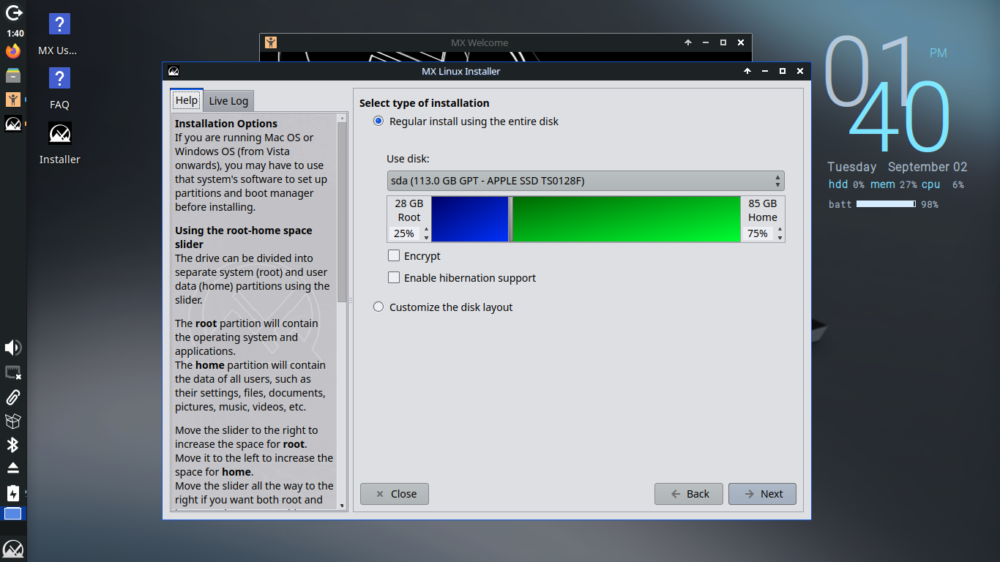

# projects

1. [fish shell init script](#1-fish-shell-init-script) - 22 mar 2025
2. [VTuber avatar on Ubuntu](#2-vtuber-avatar-on-ubuntu) - 27 apr 2025
3. [Attempt on automating a Caffeine workflow](#3-attempt-on-automating-a-caffeine-workflow) - 14 jun 2025
4. [Fish Shell Prompt](#4-fish-shell-prompt) - 17 aug 2025
5. [Arknights on Waydroid](#5-arknights-on-waydroid) - 17 aug 2025
6. [Revitalising my old Macbook with Linux](#6-revitalising-my-old-macbook-with-linux) - 3 sep 2025

---

# 1. fish shell init script
my fish config file. a simple piece of initialiser code to make the terminal more convenient for dev purposes.

written for [fish shell](https://fishshell.com/).


## files 
[config.fish](1-initscript/config.fish)

## features

### greeting message

each time the terminal is launched, or when user runs `fp`, the terminal outputs a randomised personalised greeting message (in chinese) from a curated list, with two parts:

1. flavour text
2. greeting message

See examples [here](#additional-demos).

### manual call

the command `fg` can also be run to manually call a randomised greeting. additionally, use `fg -la` to list all available greetings in the greeting pool.

edit 17/08/2025: there are now time-specific greetings. likewise, you may check the greeting pool for the current time of the day using `fg -la`.


### other abbreviations & commands 

- `c` --> `clear`
- `l` --> `ls -lha`
- `fp` --> `fish --private` (launches fish in private mode)
- `gad` --> `git add .`
- `gc` --> `git commit -S -m "%"` where % becomes cursor location
- `gp` --> `git push`
- `gpl` --> `git pull`
- `nrd` --> `npm run dev` (vite)
- `nrb` --> `npm run build` (vite)
- `nrp` --> `npm run preview` (vite)
- `co` --> `codium` (launches codium)
- `s` --> `sudo`
- `power-saver` --> `powerprofilesctl set power-saver`
- `balanced` --> `powerprofilesctl set balanced`
- `openseeface` --> `~/Documents/runOpenSeeFace.sh` (for [virtual avatar](#2-vtuber-avatar-on-ubuntu))

### additional notes
- this script also sets the Node.js version to the latest version as my machine defaults to using Node 12. this is probably due to a mismatch in $PATH but the temporary fix using `nvm use latest` works so i am sticking with that.

### additional demos

(updated 17/08/2025)


---


# 2. VTuber avatar on Ubuntu

This aims to serve as a guide and document my endeavor in figuring out how to render my virtual avatar model on Ubuntu.


## Notes

- According to some users online, Lutris sometimes works better than Bottles. I use Bottles simply because I already have Bottles installed.
- This set of [instructions](https://pastebin.com/t86VmYCc) was immensely helpful. Thank you [u/TheRogueGrunt's Reddit post](https://www.reddit.com/r/VirtualYoutubers/comments/j8ebuu/how_to_run_vseeface_on_linux/).

## Files

[runOpenSeeFace.sh](2-virtualavatar/runOpenSeeFace.sh)

## Workflow

### Setup
1. Run Bottles
2. Run VSeeFace through Bottles and select a model
3. Set up the [green screen](#setting-up-the-green-screen)
3. Run OBS Studio
4. Select VSeeFace as Pipwire window capture input
5. Open Terminal
6. Start tracking face by running the script through typing `openseeface` ([fish abbr](#1-fish-shell-init-script)) or directly running `~/Documents/runOpenSeeFace.sh`

### Streaming 

- Turn on Virtual Camera in OBS if using avatar as facecam (Discord, Meet, Teams etc)
- Turn on Stream and configure streaming if streaming to websites

#### Camera Hotkeys

1. Default: `Alt + 1`
2. Closer: `Alt + 2`
3. Close-up: `Alt + 3`
4. Extreme Close-up: `Alt + 4`
5. Full body: `Alt + 5`

... and now you are adequately set up to start streaming using your model.

---

## The process

### System

- OS: Ubuntu 22.04.5 LTS x86_64 
- Kernel: 6.8.0-58-generic 
- Shell: fish 4.0.2 
- DE: GNOME 42.9
- WM: Mutter 
- Terminal: gnome-terminal 
- CPU: Intel Ultra 7 155H (22) @ 4.500GHz 
- GPU: Intel Device 7d55 
- Memory: 8712MiB / 15594MiB 

### Software Installation

**All versions below are the versions of software used at the time of writing.**

- Bottles 51.21: https://flathub.org/apps/com.usebottles.bottles
- VSeeFace 1.13.38c2: https://www.vseeface.icu/#download
- OBS Studio 30.2.3: https://obsproject.com/download
- Fish shell 4.0.2: https://fishshell.com/

### Steps

#### Configuring Bottles & VSeeFace

- Set up Bottles
- Create an application named `VSeeFace` and click into it
- In the top right dropdown, select `Browse Files...` to open the C drive folder
- Extract everything from the VSeeFace ZIP archive into `Program Files` of the C drive
- Under `Programs`, click `Add Shortcuts` and find `VSeeFace.exe` from the extracted folder
- Under `Options`, click `Settings`
- Change runner to `sys-wine-10.0`, ensure DXVK is `dxvk-2.6.1` and VKD3D is `vkd3d-proton-2.14.1`
- Under `Display` navigate into the `Advanced Display Settings` Menu, and turn on `Virtual Desktop`, `Fullscreen Mouse Capture`, and `Take Focus`
- Return to `Programs` and run the executable to boot up VSeeFace

#### Configuring VSeeFace

- Move the `.vrm` model file (or files of other compatible formats) into the Documents folder in the C drive (**NOTE: not your Ubuntu Documents folder!**)
- In VSeeFace, add your avatar from that folder into the local avatar list

#### Configuring facetracking

##### Setting up the environment

- `sudo apt-get install python3 python3-pip python3-virtualenv git`
- Clone the OpenSeeFace repository by [emilianavt](https://github.com/emilianavt): `git clone https://github.com/emilianavt/OpenSeeFace`
- `cd ~/OpenSeeFace`
- `virtualenv -p python3 env`
- `bash` (because I am in fish terminal)
- `source env/bin/activate`
- `pip3 install onnxruntime==1.21.1 opencv-python pillow numpy`

##### Running the tracker

- `bash`
- `cd ~/OpenSeeFace`
- `source env/bin/activate`
- `python facetracker.py -c 0 --discard-after 0 --scan-every 2 --no-3d-adapt 1 --max-feature-updates 900 --model 3 --faces 1`

The above command produces the smoothest tracking motion for my machine. For higher-end machines one could probably experiment with more graphics-heavy configurations. See [OpenSeeFace README](https://github.com/emilianavt/OpenSeeFace/blob/master/README.md).

- Navigate back to `VSeeFace > Camera` and select `[OpenSeeFace Tracking]`. You may leave `Microphone`, `Listen IP` and `Port` as their default values
- Select your avatar and load it by clicking `Start`

#### Setting up the green screen

- Download any green screen wallpaper online
- Add the green screen into the bottle's files. `Documents` folder works fine
- In VSeeFace, click `Props > Add` then select the green screen to add it
- Under `Settings` for Props, drag the slider to get maximum `Distance to avatar`, maximum `Smoothing`, and uncheck `Always on top`
- Using an unused camera (inside `Settings > General Settings > Camera`), alt-click to have your avatar back-face you. Then alt-scroll to zoom out until your avatar is very small
- Drag the green screen prop **ONTO** the back of your tiny avatar. While dragging, scroll to increase the size of the green screen to cover the entirety of your background if possible
- Change the camera perspective back to the main one you are using via `Settings > General Settings > Camera`. Green screen should show behind the avatar

#### OBS Studio

- Boot up OBS Studio
- Create a new scene
- Create a new source: `Screen Capture (PipeWire)`
- Select the VSeeFace application window. Now your avatar should show up
- Right click the source, select `Transform > Edit Transform...`
- Under `Crop`, crop out the Wine Desktop borders such that only VSeeFace's application background is shown. Close `Edit Transform`
- Right click the source, select `Filters`, and add a `Chroma Key` filter. Select `Green` for `Key Colour Type`. Close `Filters`
- (Optional) Add an image source as background behind your avatar

##### OBS Virtual Camera

Linux's virtual camera is trippy. `v4l2loopback-dkms` in Ubuntu 22.04 repositories (0.12.7) does not build on Linux kernel 6.8 due to a change in the kernel’s string handling functions. Specifically, `strlcpy` was removed from the kernel, but v4l2loopback 0.12.7 still tries to use it, causing the build to fail with the `error: implicit declaration of function ‘strlcpy’; did you mean ‘strscpy’?`

To resolve this issue, build the latest version of v4l2loopback-dkms that has a patch for this.

```bash
sudo apt remove v4l2loopback-dkms
git clone https://github.com/umlaeute/v4l2loopback.git
cd v4l2loopback
make
sudo make install
sudo modprobe v4l2loopback devices=1 exclusive_caps=1 card_label="OBS-VirtualCam"
```
---


# 3. Attempt on automating a Caffeine workflow

TL;DR: My version of GNOME does not support it & I don't want to upgrade to Ubuntu 24.04 yet.

---

## What and Why?

While using my laptop to study, I often leave the laptop on a single screen for a long time as I solve the problems on paper. However, the laptop wants to turn on screensaver and go to sleep. I chanced upon [Caffeine](https://github.com/eonpatapon/gnome-shell-extension-caffeine), a GNOME extension by eonpatapon, which solved my problem by providing me with a button to toggle between keeping the screen on persistently and going to sleep after a while. (*I want that for all of my devices now...*)

On some days, I keep forgetting to turn on caffeine when coming back to a suspended session (before you tell me, yes, I do know there is an option to persist across sessions but I do not want that behaviour). Hence, naturally as any lazy person would do, I set out to write a script to help with that.

## The core concept

1. The script would activate every time I start a desktop session.
2. The script would ask me if I wished to turn on Caffeine.
3. If yes, turn on Caffeine.
4. If no, Caffeine remains off. 

Simple. Easily done with a few lines of bash script, right?

## Part I: The Startup Prompt

Since I already have a [fish init script](#1-fish-shell-init-script) set up, I can simply run the script when that init script runs. No issue.

I explored [zenity](https://help.gnome.org/users/zenity/stable/) and its functionalities, and first tried using `notification`:

```bash
zenity --notification --text "Caffeine?"
```

But with zenity notifications there exist no way (as of now) to respond to that notification being clicked. Moreover, I am perpetually on Do Not Disturb mode, meaning I cannot see the notification on starting a session anyway.

(You may be thinking "What about notify-send?" Well, it could not respond to the notification being clicked either. DND problem is still there as well)

Let's try something else. Zenity has an `info` dialogue that I can use to run my Caffeine script after clicking "Ok":

```bash
if zenity --info --text "Caffeine?"; then
  # run caffeine
fi
```

But I wanted a way to opt out. No go.

Then I tried `question`: 

```bash
if zenity --question --text "Caffeine?"; then
    # yes
    echo "Yes"
else
    # no
    echo "No"
fi
```

Wow! This is exactly what I had wanted. We are basically set.

## Part II: One-Click Coffee Machine

Now that we have that handy script to prompt us each time, let's figure out how to turn on caffeine in the command line!

After having read through the Github README, I deduced Caffeine does not seem to support control through commands. I did not want to toggle the entire GNOME extension on and off either, as I still wanted the ability to turn on Caffeine later on in the session.

I explored Caffeine's settings again, and found that it has a hotkey option. We might be able to emulate a keypress in the script to activate Caffeine!

So I set the hotkey to `super` + `c`:


Great! One step closer.

## Part III: Wayland, Mutter and the Basket of Eggs

Now let's find a way to emulate `super` + `c`.

I know of [xdotool](https://github.com/jordansissel/xdotool), and wanted to use that to emulate my keypresses with something like this:

```bash
xdotool key super+c
```

However, **xdotool works for X11, not Wayland** (which I am comfortable with using, since Wayland is the default display server for my machine). I went on to look for alternatives for Wayland, and found [wtype](https://github.com/atx/wtype), [ydotool](https://github.com/ReimuNotMoe/ydotool), and [diowtype](https://github.com/DiogenesN/diowtype).

### wtype & ydotool

First let's try wtype. This was my idea:

1. Press and hold `super`
2. Press `c`
3. Release `super`

```bash
wtype -M win -k c -m win
```

This returns:

```
Compositor does not support the virtual keyboard protocol
```

Oh boy. After [digging](https://github.com/atx/wtype/issues/22#issuecomment-1113273742) and being led to the Mutter (GNOME's core window manager and compositor) [forum](https://gitlab.gnome.org/GNOME/mutter/-/issues/1974), apparently GNOME does not support the `virtual-keyboard-unstable-v1` Wayland protocol needed for these to work due to security reasons. This means **wtype and ydotool will not work** on my machine.


This forum also mentions **libei**, which sounds potentially promising. Let's set that aside for later use.

### diowtype

The thing about diowtype is despite the fact that it can indeed run on my machine, it only emulates one single keypress at a time, not combinations. Caffeine's settings do not accept single-keypress hotkeys, so I cannot use this either.

### libei

Then I looked into [libei](https://gitlab.freedesktop.org/libinput/libei/):


In fact, Mutter had actually integrated libei in the newer versions!

I was heartened until I realised **Mutter only supports libei from Ubuntu 24.04 onwards**, while I used my trusty 22.02 Jammy. 

Darn... **I was not ready to upgrade my system so I had to call it a day.**

To end this mildly disappointing section off on a slightly more lighthearted note, here is a section from [the creator's blog](https://who-t.blogspot.com/2020/08/libei-library-to-support-emulated-input.html) regarding libei:

> What does all this have to do with eggs? "Ei", "Eis", "Brei", and "Reis" are, respectively, the German words for "egg", "ice" or "ice cream", "mush" (think: porridge) and "rice". There you go, now you can go on holidays to a German speaking country and sustain yourself on a nutritionally imbalanced diet. 


## The product

In the end, I settled with everything I had up to Part II. There would be a prompt at startup asking if I wanted to activate Caffeine, and if I selected Yes, it would prompt me to use my hotkey (`super` + `c`) to activate it. This would serve more as a reminder rather than an automation process, but I will settle for this.

### File
[caffeineReminder.sh](./3-automatedcaffeine/caffeineReminder.sh)


## Afterthoughts

This was an interesting dive into an aspect that I have hardly come into contact with. It took two hours on a splendid Saturday morning that I could have spent studying.

Upgrading to Ubuntu 24.04 and trying to fix broken dependencies last year has left a fowl taste in my mouth. Maybe in the near future, when I can wield Linux better, I will do so and finally get my daily morning fix of virtual Caffeine.


## Update - 19 Jun 2025

Putting this script inside the fish startup prompt, I realised, was not convenient at all. I had two problems:

1. The script did not run on resuming a suspended session; and

2. The script always ran whenever I started my terminal.

Hence, I decided to look into startup prompts in order to truly give myself the experience I wanted. This time, I tried using an `autostart` desktop file for running the script on startup, as well as a user service to detect when the user logs back into a suspended session.

### Autostart

I created a file in `~/.config/autostart` named [caffeineReminder.desktop](./3-automatedcaffeine/caffeineReminder.desktop).

I opted for `autostart` over putting the script inside `/etc/init.d/` or `update-rc.d` because this is, after all, a GUI prompt. I did not want to run it as root user as well.

### Systemd User Service (Attempt 1)

This part was slightly trickier. First, I made a [caffeine-on-resume.service](./3-automatedcaffeine/caffeine-on-resume.service) file and put it inside `~/.config/systemd/user`. 

Then, the service needs to be enabled: 

```bash
systemctl --user enable caffeine-on-resume.service
```

This created the correct symlink and added my service as a dependency to a non-existent unit suspend.target.

HOWEVER. I realised **this is not how it works**. Apparently, this runs the script when I suspend the session itself (I believe this was the case?), not when I resume. Thus I removed it.

```bash
systemctl --user stop caffeine-on-resume.service
systemctl --user disable caffeine-on-resume.service
```

### Systemd User Service (Attempt 2)

Let's try this again. Digging again, I found a wonderful [guide](https://ubuntuhandbook.org/index.php/2024/10/custom-actions-waking-sleep/) by Ubuntuhandbook on this subject. Unfortunately, this seems to be running the script as root and I am unsure how to make the prompt work on this one. 

Maybe next time. For now, at least the startup script works.

#### Files
[caffeineReminder.sh](./3-automatedcaffeine/caffeineReminder.sh)

[caffeineReminder.desktop](./3-automatedcaffeine/caffeineReminder.desktop)

[caffeine-on-resume.service](./3-automatedcaffeine/caffeine-on-resume.service)


# 4. Fish Shell Prompt

An attempt on further customising my terminal. Written for Fish, inspired by the inbuilt Informative style, but with some extra features.

## Files

[fish_prompt.fish](4-fishprompt/fish_prompt.fish)

## Features

### Information

> Format: [Timestamp] ($USER) ($hostname) (directory path)

- Changes colour if user is root.


### Execution Time

> Shows time taken for a command to execute if more than 3s was used.


### Directory Identification

> Relays relevant information in the context line & changes the prompt symbols based on identified directories.

- **Git**: Shows branch & current status.

- **Node**: Shows node version.

- **Python Venv**: Shows virtual environment name.

- **Docker**: Shows docker context.


(Note that Git takes precedence over Venv for prompt symbols.)

### Background Jobs

> Shows background jobs (if any) taking place in the session.


### Disk Space

> Alerts if disk space used exceeds 90%.

(No demo. My disk space has yet to exceed 90%.)

### No Write Perms

> Alerts if user is in a directory that is read-only.


### Directory Gradient

> As depth of directories increases, colour of directory increasingly becomes more red. Additionally, directory name is shortened to its first letter for directories >5 depth up from the working directory.


## Final Words

This was a fun journey as I gradually learnt more about my machine. There are many more fun things that I can do, and I am thrilled to explore them when I have time. 

I consulted Claude for some of the more technical aspects of status detection, which helped me immensely in overcoming these hurdles. 

That is all. Thank you for reading till the end of this project. See you in the next one soon.

# 5. Arknights on Waydroid

## Preface

I came across a [Waydroid](https://waydro.id/) demonstration video on Bilibili. It piqued enough of my curiosity to get me tinkering, so here is my journey.

I should probably have searched up a guide and saved some effort during the first few reinstallations though.

## The Process

> [*転生Waydroid。*](https://youtu.be/SvK3cTWDeRE)

### Part I: First Contact

1. I installed Waydroid from the official website.
2. I initialised Waydroid using **Vanilla** at first, but realised that in order to get Arknights from Google Play Store, I needed a **Google Play Store**.
3. This meant I needed an emulator that has **Google Apps**. and Vanilla did not cut it. Great.
4. Let's Reinstall.


### Part II: Google

1. Google Apps acquired! Now we boot into Waydroid!
2. Waydroid's documentation states we need to get this emulated device [certified by Google](https://docs.waydro.id/faq/google-play-certification) before we can do anything. This took around 20 minutes on Google's side.
2. Now let's head to the Play Store and download Ark... Oh. "Your device isn't compatible with this version."
3. I found [an essential script](https://github.com/casualsnek/waydroid_script?tab=readme-ov-file) to install, but I tinkered around and Waydroid eventually stopped booting. Congratulations. </3.
4. Let's Reinstall.


<!-- let's see if github formats my md images properly. -->

### Part III: Escapologist

1. Now that I have installed again from the official source, I made sure to also clone the Waydroid Script directory and install libhoudini through the CLI installation.
2. The reason why libhoudini is needed is that Arknights is compiled to run on the `ARM` architecture. This means I cannot directly run Arknights on my `x86` laptop. There needs to be an ARM translation library in place, and what works best for Intel is apparently **libhoudini**.
3. Finally! After having downloaded libhoudini (and removing the nodataperm hack which caused black screens), I could download Arknights.
4. Installation done. I clicked the icon on the desktop. I boot to a black screen. Darn. Linux is full of surprises.
5. Let's Reinstall.


### Part IV: Hope?

- Let's keep trying. This should be the right way to go, but I have not yet figured out what is stumping me. Some reference for future me:

- https://www.reddit.com/r/waydroid/comments/x988mk/installing_both_libhoudini_and_libdnk/
- https://blog.etineres.fr/posts/how-to-play-arknights-on-fedora-41-with-waydroid/
- https://blog.sww.moe/post/waydroid-arknights/

- worst case: apk


#### Preliminary Verdict

There has to be some way with which I can install and run Arknights smoothly on Waydroid. I will try some other methods in time to come. This war is not over until it is over. 

Presently it is getting late. I will call it a night for now, and hope the debugging solution comes to me in a dream.

### Part V: Resources

1. It has been a few days. I decided to try the `Vanilla` version of Waydroid & go the APK route. Let's see.
2. The apk I used to install the app is 100mb in size while the xapk on the same website is 1gb. I tried the xapk using `sudo app install Downloads/(xapk file)` but the app did not install at all. Guess xapk does not work.
3. Next, using the apk itself, the app installed. Woo! Let's open it.


### Part VI: 

TBC


# 6. Revitalising my old Macbook with Linux

## Preface

I have an old Macbook Air. I cannot remember when I had acquired it, but it runs on OS X 10.9.5 (13F1911). This machine is an 11-inch, early 2014 model and I have been using it for over ten years. It has even been bootcamped and also dualboots a Windows 7 system. Talk about retro.


Unfortunately, the battery has been degraded through the years of usage, meaning the machine can only be booted up if it is connected to the AC power source (at *just* the right angle, by the way – if the wire were to be twisted in any other way, the machine just stops). Furthermore, the native OS X is very outdated and supports virtually no modern app. The Windows 7 system can still run a bunch of things surprisingly well, but its limit is Minecraft 1.16, as it struggles to render anything but distorted polygons on 1.17 when I tested it with my buddies.

Enough said. Let's try to revitalise this good old friend of mine.

## Part I: Arch?

Originally, I had wanted to use Arch Linux and subsequently get the I-use-Arch-btw pass. However, I thought twice:


The concern mostly lies in the rolling release aspect. I would love to not have to fix everything everywhere all at once, so maybe Arch next time.

## Part II: Not Entirely Cherry

From browsing online forums, I learnt of [MX Linux](https://mxlinux.org/) (I'm always locked out of their website for some reason though). Its Debian base coupled with its popularity among the old-computer-linux community appealed greatly to me and I was sold instantly. 

I checked to see if my old Macbook could run MX Linux, and chanced upon [Action Retro's video, in which he installed MX Linux on a Macbook Air that is as old as my own](https://youtu.be/E6bTVKXGfE0). If he could do it, I can do it.

I downloaded MX Linux's `.iso` file for Live USB (Version MX 23.6 "Libretto") from [Sourceforge](https://sourceforge.net/projects/mx-linux/), then etched it to one of my few remaining USB sticks using [balenaEtcher](https://github.com/balena-io/etcher) since I had no access to Rufus on my Ubuntu system. Initially, I was worried about whether my 4GB USB stick could be used, but the `.iso` file turned out to only be 2GB. Talk about lightweight distros.

Do note that apparently you need to install firmware updates and set the volume on your OS X to an acceptable volume (or mute) first before wiping it out entirely. Installing firmware updates was not really an option for me as there were few updates compatible with my computer remaining on the App Store. The volume carries through to determine the volume setting for the booting chime of your new system, so I adjusted it to around 50%.

## Part III: Partitioning

The Live USB successfully booted, and took a surprisingly short time to boot up MX Linux from the USB for my ancient machine.  


However, life is full of surprises; this time it is not a pleasant one. The MX Linux system apparently cannot detect my SSD at all, as observed from the `Regular install using the entire disk` option being greyed out in the Partition page. 

Using `sudo fdisk -l` only shows `sda1` and `sda2`, and both of them are the boot USB itself. I even booted to Ubuntu 24's live USB to check if it was the MX Linux system's issue. No luck either.


This seemed really concerning from a quick search online, as [one of the antiX forum users](https://www.antixforum.com/forums/topic/regular-install-using-the-entire-disk-is-grayed-out/) seemed to need to factory reset the entire computer and mess with BIOS settings and also remove Windows in order to fix it. I knew how to do none of these procedures.

Thankfully, after further digging, I chanced upon an [AskUbuntu forum post](https://askubuntu.com/questions/1212573/ubuntu-installer-wont-recognize-my-ssd-on-macbook-air) that deals with a Macbook Air instead. The previous forum post had been about a Lenovo Ideapad which had a different problem. For my issue, I simply had to add `intel_iommu=off` in the live CD kernel options, which was a much simpler procedure.


## Part IV: IOSYS + REIMU = IOMMU

I followed the instructions and added the aforementioned option. For those interested, here's the procedure:

1. Boot to the GRUB screen and press arrow keys to highlight the GRUB entry to edit.

2. Press `e`, which should bring you to the kernel options (some systems may require pressing tab / space before that first? `e` just works for me though).

3. Using arrow keys to navigate, move the cursor down to the `linux` row. Add `intel_iommu=off` at the back.

4. Press `ctrl` + `x` OR `F10` to boot using these options.

The machine booted up, and with bated breath I started the MX Linux installation process. The procedure had worked! I used 28GB (25%) for Root and the remaining 85GB (75%) for Home. There was more room than I had envisioned as I was used to having only effectively 30GB per system on that machine due to the dualboot settings.




## Part V: OLD AGE OLD AGE OLD AGE 

Old is not always gold. Once I got past the previous screens, I was hit with yet another error, this time quite concerning:

  ```
  The disks with the partitions you selected for installation pass the
  SMART monitor test (smartctl), but the tests indicate it will have a
  higher than average failure rate in the near future.If unsure, 
  please exit the Installer and run GSmartControl for more 
  information.
  Do you want to continue?
  ```

Opening GSmartControl to check, it seems like my SSD has gone through its fair share of wear and tear (my Power_On_Hours is 6958... that averages to **around 2 hours of screen time every single day for ten years**! Gee...). I aborted the operation because the warning sounded quite frightening – `Reallocated Sector Count` was 1, meaning one bad sector has been found and remapped. The overall health seemed fine from [the report](6-oldmacbook/APPLE_SSD_TS0128F_74RS120ZT8VW_2025-09-02_1345.txt) though, so I proceeded to install MX Linux again after some consideration.


> "Osmanthus wine tastes the same as I remember."

## Part VI: Installation

Let's install MX Linux for real!  


## Part VII: Making the System Mine

By mine I mean my own. Not mine BitCoin.

Now that MX Linux has been properly installed, I decided to follow the footsteps of (probably) every Linux user. Here are some things that I did to customise this machine, partly referencing [FOSSLinux](https://www.fosslinux.com/67840/mx-linux-review.htm):

1. Increase font size (to 11) (`settings > appearance`)
2. Set theme (`settings > appearance`)
3. Wallpaper & splash screen (`settings > desktop`)
4. Install [Caffeine](https://linuxmasterclub.com/caffeine/) 
5. Add items to panel in items menu & Customise the panel to look like the Ubuntu one I'm used to
6. Fix potential screen tearing (`mx tools > tweak > compositor > vblank: xpresent`)
7. Enable double click (`mx tools > tweak > config options > disable single click for both desktop & thunar`)
8. Customise the desktop clock widget (`mx tools > conky`)
9. Make booting to mxlinux 3s (`mx tools > boot options`)
10. Enable antiX adblock
11. Enable default firewall options
12. Install Fish shell & use my [fish config script](#1-fish-shell-init-script) (greatly cut down)
13. Install Spotify

Voila!


> Art source seems to be [阳_伞](https://space.bilibili.com/8522878) according to a video, but I cannot tell for sure.

## Part VIII: Webcam

Added 07/09/2025.

Today I entered a video call and realised the webcam could not be detected. Worry not, though, for I found the exact post (or rather string of posts) to solve my issue. It led me to a [script](https://gist.github.com/ukn/a2f85e3420ae7d0f64db2274a9bc106b) on Github that seems to work, so I tried it.


Here's what I did:

```bash
nano installwebcam.sh
# (pastes the script in)

sudo chmod +x ./installwebcam.sh
sudo ./installwebcam.sh
```

Unfortunately, I ran into some issues when I ran this script. An error popped up, saying:

> install: cannot change permissions of ‘//usr/lib/firmware/facetimehd’: No such file or directory

Sounds like an easy fix. I just made the directory and ran the script again:

```bash
sudo mkdir -p /usr/lib/firmware/facetimehd
sudo ./installwebcam.sh
```

Okay. This time it worked, albeit with some errors still:

> Warning: modules_install: missing 'System.map' file. Skipping depmod.
> modprobe: FATAL: Module bdc_pci not found.

These should be harmless as I do not have bdc_pci in my system anyway. For the depmod, I ran it manually:

```bash
sudo depmod -a
```

Now all that's left for us to do is to load the driver manually:

```bash
sudo modprobe facetimehd
dmesg | grep facetimehd

# and now to see if the driver is actually loaded:
v4l2-ctl --list-devices
```


You can see that the webcam is indeed loaded. Wonderful!

Here's how it looks like. The other folks even say that this 720p camera appears clearer than that of my daily drive machine. I don't know what to think of that but guess Apple really was in its prime.


## Future Improvements & Final Words

The machine is still quite bare even after all the customisations, and I believe I will come to make many more modifications to it as I daily (or rather nightly) drive it. One day, I may get an SSD that is not starting to corrupt and transfer everything out (apparently the erosion snowballs), but that is only after I replace the battery as well. Let's not get ahead of ourselves here – this Macbook's power is still on life support. Here are some things on the future roadmap:

- REPLACE THE BATTERY
- REPLACE THE SSD
- Chinese Pinyin using Fcitx (subsequently, FlyPY / Xiaohe Shuangpin)
- Automation scripts?
- Power management with TLP

The computer is now capable of everyday tasks such as document editing and basic entertainment with Youtube and Bilibili, not to mention these are being done at lightning-fast speeds thanks to the XFCE desktop environment. The only pity is that there is only 4GB of memory, which is SOLDERED onto the logic board. Nonetheless, I am quite content with how this installation has turned out, and although I get somewhat sentimental thinking about the now-wiped Windows 7 system that has spent ten years with me, this breathing of new air into the Macbook Air (haha... get it...) is sure to bring us to new heights.

> Arch next time, btw.